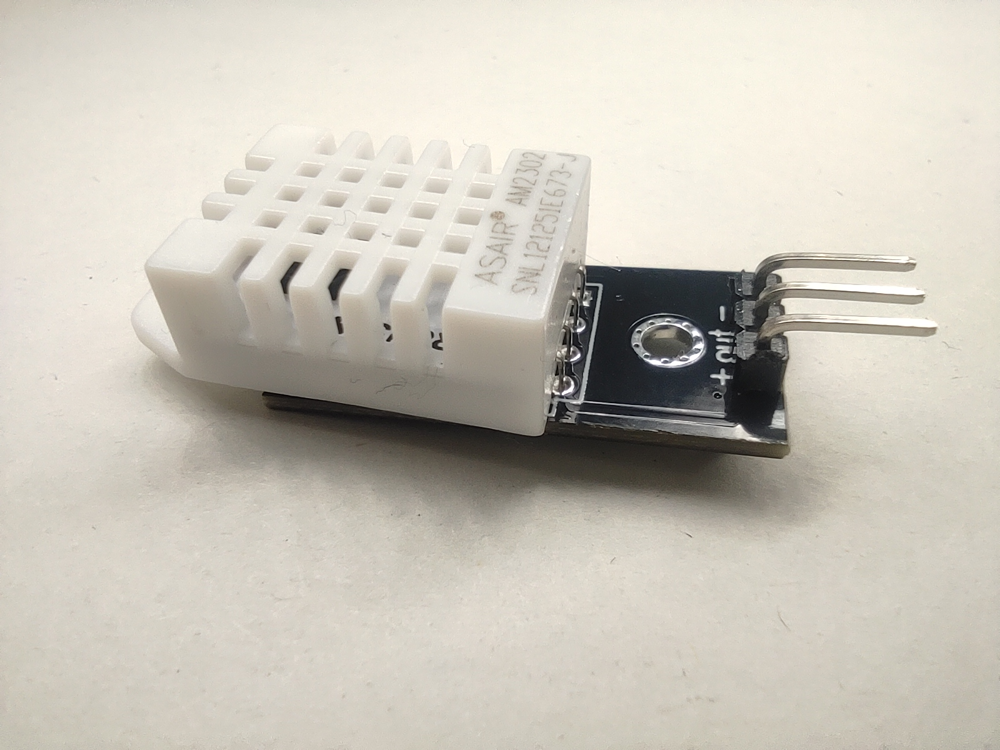

# Andamento dei lavori WineControl

### 27 aprile 2022

Finalmente mi sono deciso ad iniziare il mio primo progetto con Arduino, o meglio con i mitici ESP8266.

Ho comprato su amazon quello che credo sia il necessario per tutto il progetto (sicuramente esclusa la parte estetica), sicuramente avrò dimenticato qualcosa, in cima comunque aggiornerò tutto il materiale usato!

Veniamo al dunque, ecco cosa ho comprato oggi:

* [3 ESP8266 Modulo ESP-12F](https://www.amazon.it/gp/product/B08JQKCRL7/ref=ppx_yo_dt_b_asin_title_o03_s00?ie=UTF8&psc=1)
  * Ho comprato il kit da 3 perchè ho già in mente altri progetti, e avere degli ESP in casa non fa mai male!
* [DHT22 AM2302](https://www.amazon.it/gp/product/B078SVZB1X/ref=ppx_yo_dt_b_asin_title_o02_s00?ie=UTF8&th=1)
  * Il DHT22 è più costoso ma più preciso del DHT11, inoltre questo modulo ha già il PCB con la resistenza, basta alimentarlo e collegarlo su un digitale e il gioco è fatto! 
* [Lettore scheda MicroSD](https://www.amazon.it/gp/product/B01DNXWVES/ref=ppx_yo_dt_b_asin_title_o04_s00?ie=UTF8&psc=1)

Ho deciso di comprare tutto su amazon perchè la differenza di prezzo con altri store cinesi (Aliexpress) non era poi così tanta, ho preferito spendere un euro in più ed avere tutto subito e con un po' di garanzia!

### 28-30 aprile 2022

In questi 3 giorni è arrivato tutto, devo dire pure prima del previsto!

Bando alle ciance, ecco qua i componenti che ci interessano:

* **ESP8266**:

<table style="border-style: none">
    <tr>
        <td></td>
        <td></td>
        <td></td>
    </tr>
</table>

* **DHT22**

<table style="border-style: none">
    <tr>
        <td></td>
        <td></td>
        <td></td>
    </tr>
</table>

* **MicroSD Reader**

<table style="border-style: none">
    <tr>
        <td></td>
        <td></td>
    </tr>
</table>